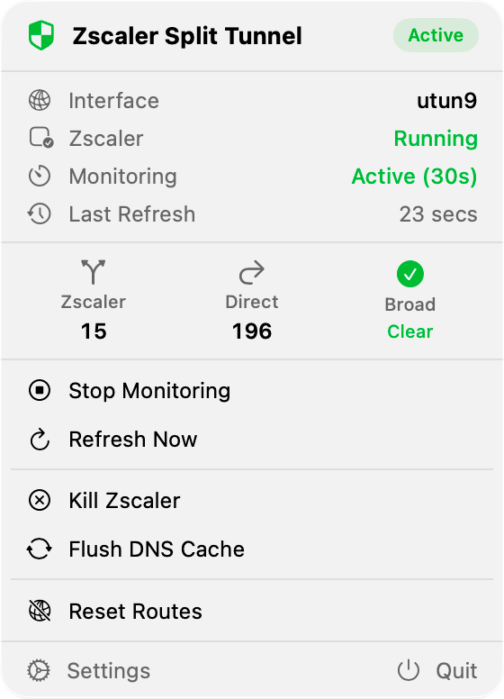

# Zscaler Split Tunnel for macOS

Zscaler Split Tunnel is a macOS utility for keeping Zscaler active only where
you need it. It removes Zscaler's broad catch-all routes, restores explicit
routes for corporate resources, and lets the rest of your traffic use the
normal network path.

<p align="center">
  
</p>

The project includes two operating modes:

| Mode | Best for | Interface |
| --- | --- | --- |
| Native macOS app | Day-to-day use, status checks, route editing, and helper operations | SwiftUI menu bar app with a privileged helper |
| Shell daemon | Headless or scriptable environments | Bash daemon with launchd autostart support |

> This is an independent utility and is not affiliated with Zscaler. It changes
> macOS routes and may interrupt network access if misconfigured. Review your
> routes before using it on a production laptop.

## Highlights

- Removes Zscaler's broad IPv4 routes that capture most internet traffic.
- Restores only the configured domains, IPs, and CIDR ranges through Zscaler.
- Supports direct overrides for destinations that must bypass Zscaler.
- Monitors network and configuration changes, then refreshes routes automatically.
- Resolves domains to IP addresses with local caching.
- Provides a SwiftUI menu bar app with live status, route counters, and controls.
- Includes a scriptable daemon for teams that prefer CLI-first operation.
- Supports optional office WiFi routing for direct overrides when a corporate
  Ethernet network is detected.

## Quick Start

Clone the repository and install the shell daemon:

```bash
git clone https://github.com/balcsida/zscaler-split-tunnel.git
cd zscaler-split-tunnel

chmod +x zscaler-split-tunnel.sh
sudo mkdir -p /usr/local/bin
sudo cp zscaler-split-tunnel.sh /usr/local/bin/zscaler-split-tunnel
sudo chmod +x /usr/local/bin/zscaler-split-tunnel
sudo zscaler-split-tunnel --start
```

Check the current state without `sudo`:

```bash
zscaler-split-tunnel --status
zscaler-split-tunnel --list
```

## Native Menu Bar App

The native app lives in `macOS/` and pairs a SwiftUI menu bar interface with a
privileged helper installed through SMJobBless. It is intended for interactive
use: start or stop monitoring, refresh routes, manage Zscaler, flush DNS, and
edit both route lists from a settings window.

Build from source with Xcode 16+:

```bash
cd macOS
xcodegen generate
open ZscalerSplitTunnel.xcodeproj
```

Build both targets:

- `ZscalerSplitTunnel`
- `com.zscaler-split-tunnel.helper`

The app runs as a menu bar item. The helper performs privileged route
operations through XPC; the app itself stays unprivileged.

## CLI Usage

### Service Control

```bash
# Start split tunneling and start Zscaler if needed
sudo zscaler-split-tunnel --start

# Stop the split tunnel daemon
sudo zscaler-split-tunnel --stop

# Stop Zscaler app and services
sudo zscaler-split-tunnel --kill

# Run the daemon in the foreground while debugging
sudo zscaler-split-tunnel --daemon --verbose
```

### Zscaler Routes

Zscaler routes are destinations that should continue to use the Zscaler tunnel.

```bash
zscaler-split-tunnel --add internal.company.com
zscaler-split-tunnel --add 192.168.1.0/24
zscaler-split-tunnel --add 10.0.0.5

zscaler-split-tunnel --remove internal.company.com
zscaler-split-tunnel --show-config
zscaler-split-tunnel --clear-config
```

### Direct Overrides

Direct overrides are destinations that should use the normal gateway even when
Zscaler has installed a more-specific route for them.

```bash
zscaler-split-tunnel --add-bypass api.example.com
zscaler-split-tunnel --remove-bypass api.example.com
zscaler-split-tunnel --show-bypass
zscaler-split-tunnel --clear-bypass
```

### Autostart

Install or remove the launchd service:

```bash
sudo zscaler-split-tunnel --enable-autostart
sudo zscaler-split-tunnel --disable-autostart
```

## Configuration

Team defaults are versioned in this repository:

| File | Purpose |
| --- | --- |
| `config/zscaler-split-tunnel.conf` | Default destinations routed through Zscaler |
| `config/zscaler-bypass.conf` | Default direct overrides routed outside Zscaler |

User-specific files live under `~/.config/zscaler-split-tunnel/`:

| File | Purpose |
| --- | --- |
| `routes.conf` | User Zscaler routes |
| `bypass.conf` | User direct overrides |
| `office-mode.json` | Optional office WiFi routing settings |
| `domain-cache.txt` | Runtime domain resolution cache |
| `remote-route-cache.txt` | Runtime cache for remote route lists |

Example `routes.conf`:

```text
# Domains, IPs, or CIDR ranges routed through Zscaler
internal.company.com
vpn.company.com
192.168.100.0/24
10.0.0.50
```

The `--add`, `--remove`, `--add-bypass`, and `--remove-bypass` commands update
the user files. Defaults remain untouched, and a running daemon reloads changes
automatically.

## Office WiFi Routing

Office mode can route direct overrides through a guest WiFi gateway when the Mac
is connected to a corporate Ethernet network. The detector uses CDP/LLDP
discovery packets and an optional switch-name allow list.

Create `~/.config/zscaler-split-tunnel/office-mode.json`:

```json
{
  "enabled": true,
  "targetSSID": "Guest_WiFi",
  "cdpGracePeriodSeconds": 120,
  "switchNamePatterns": []
}
```

Leave `switchNamePatterns` empty to accept any detected switch while office mode
is enabled.

## How It Works

1. Zscaler installs broad routes such as `1.0.0.0/8`, `2.0.0.0/7`, and
   `128.0.0.0/2` that can capture most IPv4 traffic.
2. The tool removes those broad routes.
3. It resolves configured domains, validates IPs and CIDR ranges, and adds
   explicit routes for Zscaler destinations through the active `utun` interface.
4. It applies direct overrides through the normal gateway, or through the office
   WiFi gateway when office mode is active.
5. A monitor loop refreshes route state on a low-frequency interval and reacts
   to configuration or network changes.

## Files and Logs

| Path | Description |
| --- | --- |
| `/tmp/zscaler-split-tunnel.log` | Shell daemon log |
| `/tmp/zscaler-split-tunnel.pid` | Shell daemon PID file |
| `/Library/LaunchDaemons/com.github.zscaler-split-tunnel.plist` | Optional launchd service |
| `~/.config/zscaler-split-tunnel/` | User configuration and runtime caches |

## Troubleshooting

Inspect the current state:

```bash
zscaler-split-tunnel --status
zscaler-split-tunnel --list
```

Follow daemon logs:

```bash
tail -f /tmp/zscaler-split-tunnel.log
```

Verify where a destination is routed:

```bash
route get "$(dig +short example.com | head -1)"
```

If a destination is not loading:

1. Confirm DNS resolution with `dig +short yourdomain.com`.
2. Check the selected route with `route get <ip-address>`.
3. Inspect the route table with `netstat -rn`.
4. Test connectivity with `curl -I https://yourdomain.com`.
5. Review recent helper or daemon logs before changing the route list.

## Requirements

- macOS 14 or newer for the native app
- Zscaler Client Connector installed
- Administrator privileges for route changes
- Standard macOS command line tools: `route`, `netstat`, `dig`, and `curl`
- Xcode 16+ and XcodeGen for the native app

## Security Notes

- The privileged helper and shell daemon execute `/sbin/route`; keep route input
  limited to trusted domains, IP addresses, and CIDR ranges.
- Do not commit personal routes, credentials, private hostnames, or internal URLs.
- Test route changes on a non-critical network before deploying broadly.
- Use the status and route inspection commands before and after changing config.

## License

MIT
